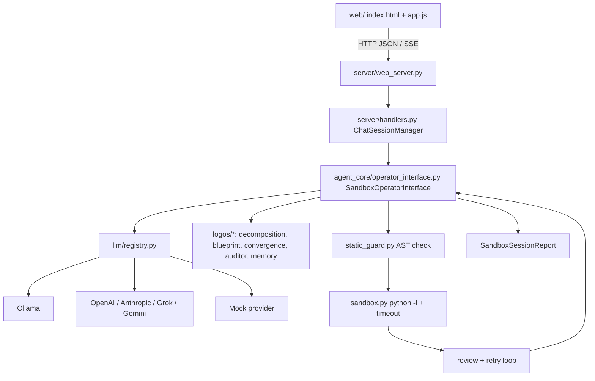

# Architecture

```mermaid
flowchart TD
  UI[web/ index.html + app.js] -->|HTTP JSON / SSE| WS[server/web_server.py]
  WS --> CSM[server/handlers.py ChatSessionManager]
  CSM --> OP[agent_core/operator_interface.py SandboxOperatorInterface]
  OP --> REG[llm/registry.py]
  REG --> OLL[Ollama] & CLOUD[OpenAI / Anthropic / Grok / Gemini] & MOCK[Mock provider]
  OP --> LOGOS[logos/*: decomposition, blueprint, convergence, auditor, memory]
  OP --> GUARD[static_guard.py AST check]
  GUARD --> SB[sandbox.py python -I + timeout]
  SB --> REVIEW[review + retry loop]
  REVIEW --> OP
  OP --> REPORT[SandboxSessionReport]
```

Each task runs a loop: plan (LOGOS), generate (LLM), guard, execute (sandbox), review, then
retry up to `max_retries`. The result is returned as a `SandboxSessionReport`.
